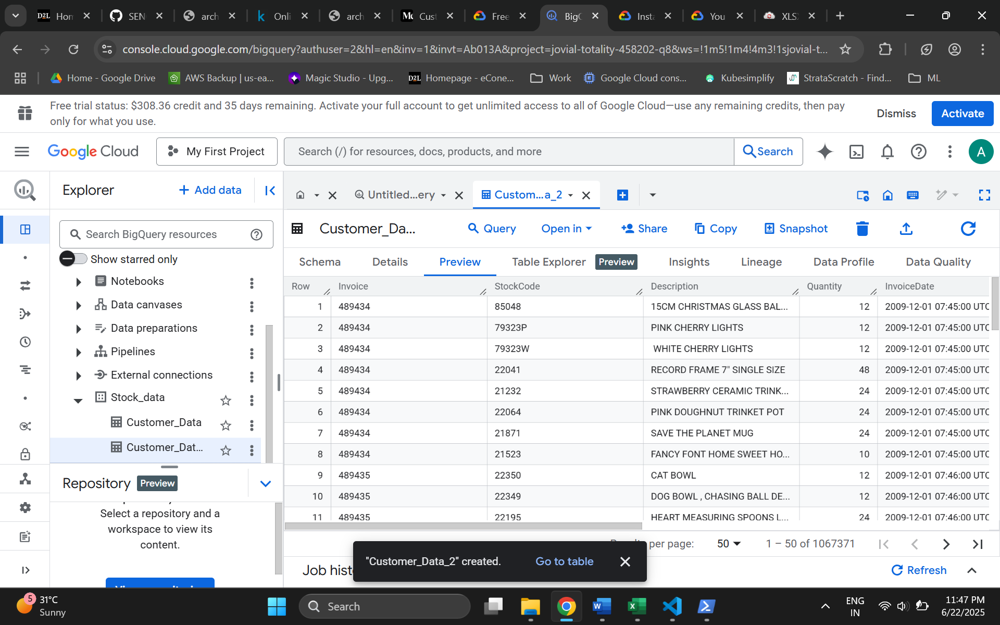

# SENG8081-S25-Team4
Team Members and their roles:
Harsimranjit Singh- Team Lead;

Anhadpreet Singh - Research & Data Engineer;

Sandeep Kaur- DevOps / Git Manager;

Gurpreet Kaur - Documentation Manager

This project, titled "Unlocking Customer Insights: RFM-Based Segmentation Using Retail Transaction Data," focuses on analyzing customer purchasing behavior by applying Recency, Frequency, and Monetary (RFM) analysis to a comprehensive online retail dataset. By segmenting customers based on their transaction history, the project aims to identify distinct customer groups, enabling more targeted marketing strategies and improved business decision-making.

Project detail
data 1 . https://archive.ics.uci.edu/dataset/352/online+retail
Data 2 . https://www.kaggle.com/datasets/mashlyn/online-retail-ii-uci?resource=download

Raw data

Data Cleaning 

Validated all the data columns with respect to data types

Data saved into Google Bigquery with the help of Google SDK , Screenshot has been attached for the reference

